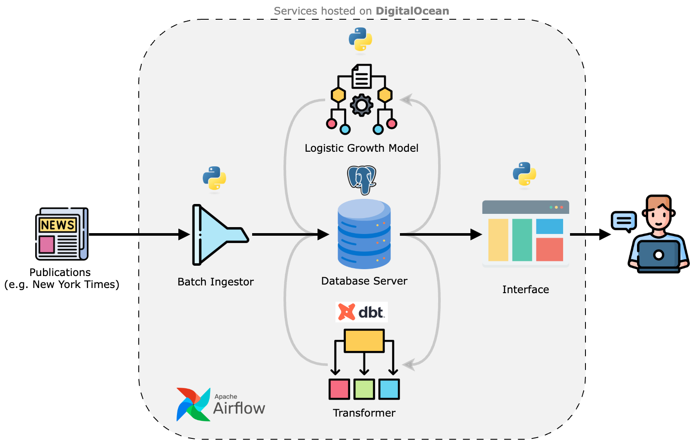

# Headlines Data Pipeline ('Newton') 📰 🌃

A data pipeline project dedicated to the extraction &amp; analysis of headline data from famous publications such as the [New York Times](https://developer.nytimes.com/)

## Background 👓 

This project originated from an interest in modelling reporting trends (in news headlines) 
across various media outlets. 

Luckily, outlets like the New York Times ("NYT") kindly provide an [API service](https://developer.nytimes.com/) completely free of charge which, amongst other things, can be used to extract data on historical article headlines. 

## Scope

To keep things simple, the scope of this project is limited to NYT (for now). 

That said, this software has been designed to be flexible enough to accomodate other sources of data in the future.

## Architecture

 
  

