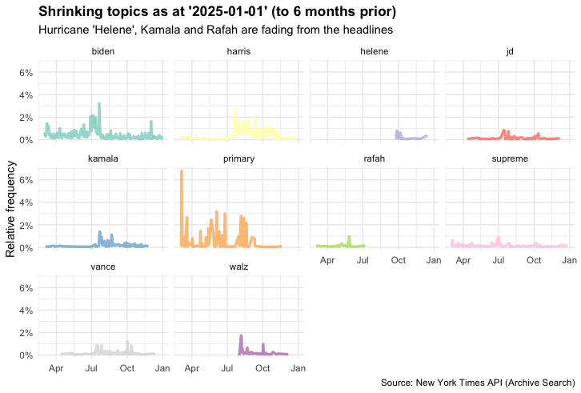

# Headline Analytics (ELT) Pipeline 📰 

> **Project Status:** In Progress

A data pipeline project dedicated to the extraction &amp; analysis of headline data from famous publications such as the [New York Times](https://developer.nytimes.com/)

## Background 🌆 

This project originated from an interest in modelling 'topic' trends (in news headlines) 
across various media outlets.

You can understand topic trends by fitting a [logistic growth model](https://sites.math.duke.edu/education/ccp/materials/diffeq/logistic/logi1.html) to each 'topic'. The magnitude and polarity of the resultant 'growth'
coefficient (calculated across each topic) informs us the degree to which each topic is trending
or shrinking in popularity.

### Growing Topics :chart_with_upwards_trend:

For example, here are the top 10 trending topics in the New York Times for the period 1st July 2024 to 1st January 2025
as determined by the logistic growth model that is embedded inside this analytics pipeline,

<div align="center"> 
  
    <p><em>Figure: top 10 trending topics from 1st July 2024 to the 1st January 2025</em></p>
</div>

### Shrinking Topics :chart_with_downwards_trend:

Conversely, here are the top 10 _shrinking_ topics for the same publication period,

<div align="center"> 
  
    <p><em>Figure: top 10 shrinking topics from 1st July 2024 to the 1st January 2025</em></p>
</div>

## Architecture 🌃

<div align="center"> 
  
    <p><em>Figure: architecture of the EtLT pipeline and associated views ('Interface'). Icons sourced from <a href="flaticon.com">flaticon.com</a></em></p>
</div>

The specific architectural decisions made above are expounded upon in slightly more detail in [docs/Architecture.md](docs/Architecture.md)

To read more about each of these services,

* **Orchestration** :hourglass_flowing_sand: implemented via [Prefect](https://www.prefect.io/). Supplementary documentation can be found at [docs/Orchestration.md](docs/Orchestration.md)
* **ELT** :ocean: implemented in Python & [`dbt`](https://docs.getdbt.com/). Supplementary documentation can be found at [docs/ELT.md](docs/ELT.md)
* **Logistic Growth Model** :chart_with_upwards_trend: implemented in Python (via `statsmodels` framework). Supplementary documentation on the chosen methodology and implementation can be found at [docs/Algorithm.md](docs/Algorithm.md)
* **Docker** :ship: the choice of architecture to support the deployment. Supplementary documentation can be found at [docs/Docker.md](docs/Docker.md)

## Prerequisites :warning:

To replicate this project you will need to configure the following prerequisites,

* An active version of 'Python'. Version for this project,
  ```
  Python 3.12.8
  ```
* An active version of 'Docker'. Version for this project:
  ```
  Docker version 27.4.0, build bde2b89
  ```

* Please also note that this project was built with the following version of MacOS,

  ```
  ProductName:            macOS
  ProductVersion:         15.1.1
  BuildVersion:           24B91
  ```

There *may* be certain intricacies involved (that are not documented here) when replicating the project on your local host. 

This is, of course, perhaps a case to containerise the entire solution (not just parts of it) but, alas, this has not yet been configured!

## Setup :wrench:

To configure the ELT pipeline and the logistic growth model in your local environment, you must observe the following steps:

1. Clone this repository into your local area
2. Configure Python dependencies by running: 
    ```
    # Create & activate a virtual environment
    python -m venv venv
    source venv/bin/activate

    # Install dependencies
    pip install -r requirements-dev.txt
    ```
3. Initialise the database & database administration system via Docker (this will run Docker in the background; you can verify the success of this step by running `docker ps` or surfing to http://localhost:8888 and logging into the DBA system),
    ```
    docker compose up -d
    ```
    Note that this relies on certain 'secrets' being setup beforehand. You can read more about this 
    on Docker's official website: https://docs.docker.com/compose/how-tos/use-secrets/
4. (Optional) If running on MacOS, export `DOCKER_HOST` environment variable and authenticate with
Docker Hub from within your local environment (depends on OS and setup; running `docker context ls` will show you what to export)
    ````
    export DOCKER_HOST="unix:///Users/Johnny/.docker/run/docker.sock"
    ````
5. Start the Prefect API server (you can verify the success of this step by browsing http://localhost:4200)
    ````
    prefect server start
    ````
6. Create a work pool,
    ````
    prefect work-pool create --type docker --base-job-template config/base-job-template.json docker-pool
    ````
7. Start a 'worker' to poll the aforementioned pool (via the Prefect API) for jobs
    ````
    prefect worker start --pool docker-pool
    ````
8. Before deploying the solution you will need to configure certain environment variables,
    ```
    NYTAS_API_KEY=<XXX>  
    DB_NAME=<XXX>
    DB_USER=<XXX>
    DB_PWD=<XXX> 
    DB_HOST=<XXX>
    DB_PORT=<XXX>
    ```
    See step 3 (Docker) for more information on variables of the format `DB_*`
9. You can now deploy the ELT pipeline & the logistic growth model by running,
    ```
    # ELT
    python _pipeline_deploy.py

    # Logit 
    python _logit_deploy.py
    ```

You should be able to then run the flows manually using `tools/_pipeline_run.py` or `tools/_logit_run.py` after 
following these steps! However, they will be deployed on a monthly schedule by default :smile:

## Lessons Learned

Some items of difficulty which came up (that I did not expect),

* Networking is a subject in itself. I *did* eventually work out how to integrate all of my containers (and the Prefect orchestration process) so that they could all communicate but it took a lot of fiddling around!
* Prefect is amazing and I love the community they have built on Slack; if you were building a
process in-house you might consider Airflow purely because the community is much
larger and problems can often be solved quicker (I have not personally used Airflow so I cannot comment on this). That said, I really like the Prefect community and I do think Prefect is an amazing 'lean'
product - it reminded me of toying about with `flask` in days gone by 
* It goes without saying that I would *not* endorse running an integral data warehouse like this inside a Postgres container. Whilst the data can be backed up, with a greater amount of capital, you're better off hosting this data in AWS Redshift, or Snowflake and the like

Some things that are left TODO include,

* Add more unit tests. If this were an enterprise-grade project, there would be more testing baked into this but I have not been quite as diligent here in the absence of time
* Configure a proper interface for the output. At the moment we just spit out data visualisations as `.png` files. It might be nice to create a very simple dashboard instead, although I am profesionally very cautious when it comes to pointless dashboards, hence the initial hesitation here!
* Incorporate other media outlets into the data pipeline. At the moment, this pipeline focuses solely
on the New York Times archive but other outlets (such as the Guardian) offer similar API endpoints
* Deploy solution to another remote host (e.g. on Digital Ocean) and [daemonize the Prefect worker process](https://docs-3.prefect.io/v3/deploy/daemonize-processes?gad_source=1&gclid=Cj0KCQiAj9m7BhD1ARIsANsIIvAAWi44C98R-7i0P3hsNItPxGlQYnwkmPPlResQEOoUExrCUn13JtYaAisiEALw_wcB). The only reason this has not been done yet is because time is a precious resource and I have a day job!

## Contact :email:

Please feel free to contact me if you have any questions at: johnnyb1694@gmail.com


