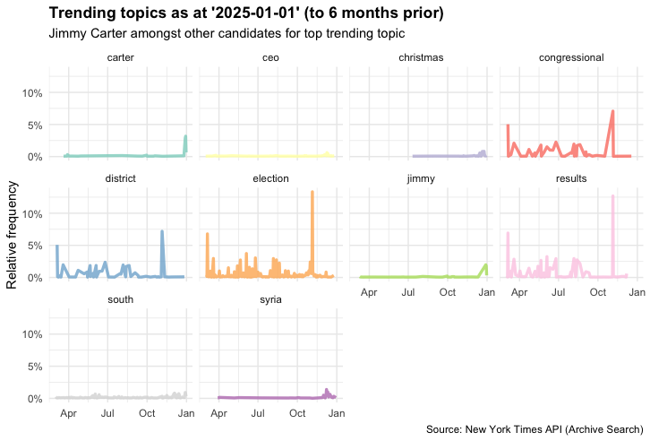

# Headline Analytics (ELT) Pipeline 📰 

> **Project Status:** In Progress

A data pipeline project dedicated to the extraction &amp; analysis of headline data from famous publications such as the [New York Times](https://developer.nytimes.com/)

## Background 🌆 

This project originated from an interest in modelling 'topic' trends (in news headlines) 
across various media outlets.

You can understand topic trends by fitting a [logistic growth model](https://sites.math.duke.edu/education/ccp/materials/diffeq/logistic/logi1.html) to each 'topic'. The magnitude and polarity of the resultant 'growth'
coefficient (calculated across each topic) informs us the degree to which each topic is trending
or shrinking in popularity.

For example, here are the top 10 trending topics for the period 1st July 2024 to 1st January 2025
as determined by the logistic growth model,

 
  
    
<em>Figure: top 10 trending topics from 1st July 2024 to the 1st January 2025</em>

## Scope 👓

To keep things simple, the scope of this project is limited to NYT (for now). 

That said, this software has been designed to be flexible enough to accomodate other sources of data in the future.

## Architecture 🌃

 
  
    
<em>Figure: architecture of the EtLT pipeline and associated views ('Interface')</em>

