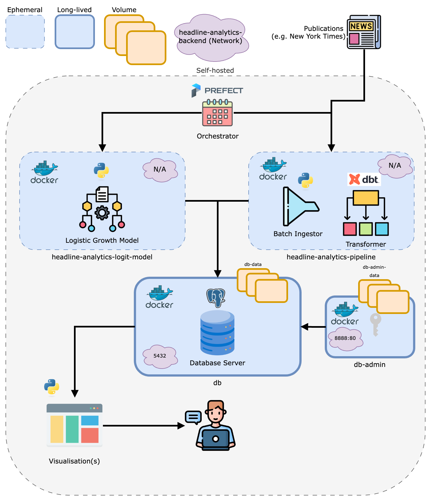

# Architecture

## Objective

Before we decide on what we should build, we need to understand how this project can 
be _used_ by another client.

My personal motivation for creating this project stemmed from an interest in understanding reporting 
trends (and topic popularity) in the wider news space.

As such, it stands to reason that the following questions should be answered by this system:

* Between dates X and Y, which topics were 'growing' in popularity? 
* Conversely, in a similar respect, which topics were 'shrinking' in popularity?
* Which topic(s) is (are) most popular within a given timeframe?

## Overview

Here is an overview of the entire architecture, including some basic information on the Docker network
that powers everything,

  
  
<em>Figure: architecture of the ELT pipeline</em>

## Docker

Docker is used to 'isolate' each process.

The Postgres database (container alias: `db`) will be persisted using volumes and, at the appropriate time, backed up on a schedule to the appropriate bucket.

Usage of `docker` is expounded upon in the associated documentation `Docker.md`

## Postgres

The decision to opt for Postgres (despite its status as an OLTP system) is one of pragmatism: we 
could, in theory, spin up a true OLAP system in the cloud but at the scale we are operating Postgres 
is more than capable of handling the load (if there _is_ a  load at all, in truth).

Debate has been had over whether to use an in-process solution like DuckDB but since we would like 
to eventually expose analytical output stored in the database to other services 
(e.g. some kind of presentation layer), it is easier - and makes more sense - to centralise the 
database in another container and expose that process to other services. 

## dbt

The framework `dbt` - which is *tehnically* just a Python package - will allow us to write clear transformation logic (with a coherent data lineage) that will make our analytical products much more efficient by reducing lead times on queries.

Usage of `dbt` is expounded upon in the associated documentation `ELT.md`.

## Prefect

The framework `Prefect` - also *technically* a Python package - allows you to orchestrate a series of dependent steps (which `Prefect` calls 'tasks') into an entire pipeline (which `Prefect` calls a 'flow').

A considerable amount of effort in this project went into this orchestration piece. Please do read `Orchestration.md` for further information on this topic.

## Python

Python is the instrument of choice for developing the logistic growth model. I used the `statsmodels` library to do so.

For more information on the methodology behind the algorithm choice, please see the documentation `Algorithm.md`.

