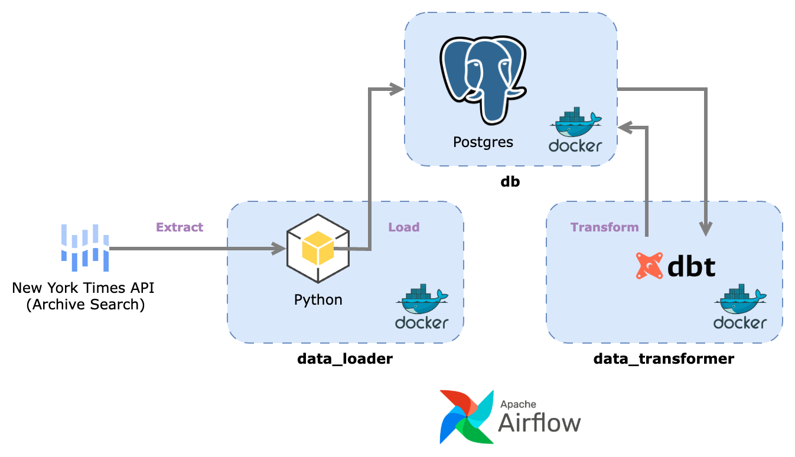

# Architecture

## Objective

Before we decide on what we should build, we need to understand how this project can 
be _used_ by another client.

My personal motivation for creating this project stemmed from an interest in understanding reporting 
trends (and topic popularity) in the wider news space.

As such, it stands to reason that the following questions should be answered by this system:

* Between dates X and Y, which topics were 'growing' in popularity? 
* Conversely, in a similar respect, which topics were 'shrinking' in popularity?
* Which topic(s) is (are) most popular within a given timeframe?

## Data Pipeline (EtLT)

To support the analysis of NYT reporting trends, we will first need to build an ELT pipeline that is 
capable of ingesting, loading and transforming data on the underlying headline data that forms part 
of the Archive Search API response.

One approach might be as follows (note: each box represents a different sandboxed, 
containerised environment):

  
  
<em>Figure: architecture of the ELT pipeline</em>

The basic process is as follows:

* __Extract__: data is extracted from the relevant API as JSON, flattened and then dumped in a local 
'staging' area (a local folder)
* __Load__: the CSV file(s) is (are) loaded into the Postgres database
* __Transform__: `dbt` creates a transformation pipeline which manipulates the data stored in the 
staging area and prepares it for analysis 

## Docker

Docker will be used to 'isolate' each process.

The Postgres database (container alias: `db`) will be persisted using volumes and, at the appropriate time, backed up on a schedule to the appropriate bucket.

## Postgres

The decision to opt for Postgres (despite its status as an OLTP system) is one of pragmatism: we 
could, in theory, spin up a true OLAP system in the cloud but at the scale we are operating Postgres 
is more than capable of handling the load (if there _is_ a  load at all, in truth).

Debate has been had over whether to use an in-process solution like DuckDB but since we would like 
to eventually expose analytical output stored in the database to other services 
(e.g. some kind of presentation layer), it is easier - and makes more sense - to centralise the 
database in another container and expose that process to other services. 

## Airflow

To orchestrate 'events' in the pipeline (e.g. extracting data from the New York Times API), we will use Apache Airflow.

## dbt

The framework `dbt` - which is *tehnically* just a Python package - will allow us to write clear transformation logic (with a coherent data lineage) that will make our analytical products much more efficient by reducing lead times on queries.

Usage of `dbt` is expounded upon in the associated documentation `EtLT.md`.

