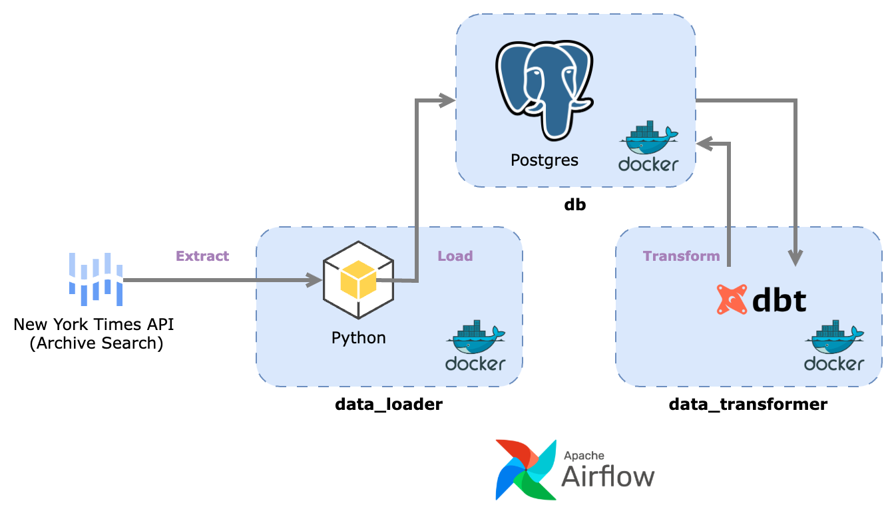
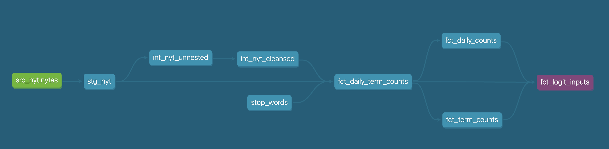
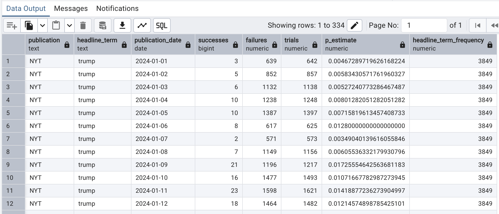

# EtLT - Infrastructure

## Scope

This document outlines the structure of the EtLT infrastructure, namely:

* `src/data_loader`: responsible for loading data into Postgres
* `src/data_transformer`: responsible for 'big T' transformations post upload via `dbt`
* `src/db`: responsible for initialising the database infrastructure (once at the start)

## Data Pipeline (EtLT)

To support the analysis of NYT reporting trends, we will first need to build an ELT pipeline that is 
capable of ingesting, loading and transforming data on the underlying headline data that forms part 
of the Archive Search API response.

  
  
<em>Figure: architecture of the ELT pipeline</em>

The basic process is as follows:

* __Extract__: data is extracted from the relevant API as JSON, flattened and then dumped in a local 
'staging' area (a local folder)
* __Load__: the CSV file(s) is (are) loaded into the Postgres database
* __Transform__: `dbt` creates a transformation pipeline which manipulates the data stored in the 
staging area and prepares it for analysis 

## `data_loader`

The `data_loader` container is simply responsible for:

1. `extract.py`: extracting data from a certain publication outlet (e.g. the New York Times)
2. `load.py`: flattening the resultant JSON into a CSV format and uploading to Postgres (via the `COPY` statement)

There _is_ a 'little t' transformation as well (cf. `transform.py`) which applies some very minor
transformations to the extracted publications archive (such as reformatting dates) but, the bulk
of the work executed by this application is the 'EL' part of 'EtLT'!

## `data_transformer`

The `data_transformer` container is responsible for transforming the data that has been staged
by the `data_loader` container via the transformation framework [dbt (core)](https://www.getdbt.com/).

The entire lineage is as follows,

  
  
<em>Figure: data lineage of `data_transformer`</em>

To explain, step by step (left to right), what is happening here:

* `src_nyt.nytas`: the raw source data that has been loaded by the `data_loader` module is stored in the entity `src_nyt.nytas`
* `stg_nyt`: some very minor cleansing exercises are then applied to this entity which leads to the 'staging' table `stg_nyt`
* `int_nyt_unnested`: we then ingest this staging data and 'unnest' all of the headlines so that each row represents a headline *term* (this is the structure of `int_nyt_unnested`)
* `int_nyt_cleansed`: we then proceed with some 'cleansing' transformations - to create `int_nyt_cleansed` - as some of the headline terms are not conducive to text mining (e.g. numeric-valued entires like '$100' or empty strings '')
* `fct_daily_term_counts`: finally, the unnested, cleansed terms are combined with a 'seed' file of stop words and aggregated (in frequency terms) into a miniature warehouse of headline term counts by date (this is )
* `fct_logit_inputs`: the ultimate goal of the transformation pipeline is to create some inputs which can be consumed by a logistic regression model to figure out which terms are 'trending' and which terms are 'shrinking'

The final 'logit' fact table (which, broadly, details the relative frequency of each specific term / topic by publication date) looks a little bit like this,

  
  
<em>Figure: shows an example of a term 'trump' and how the relative frequency (`p_estimate`) is changing over time</em>

## TODO

Some items that may require attention at some point:

* Many functions in the `data_loader` module are prepended with `nytas` to indicate that the functionality relates to the 
publication API 'New York Times Archive Search'; however, perhaps a better method of organisation
would be to place all related functions inside a module or submodule and delegate the prefix to
Python (this is perhaps a better long term solution!)
* Investigate slicker options of deploying changes to Postgres (perhaps `liquibase` or o/w)

