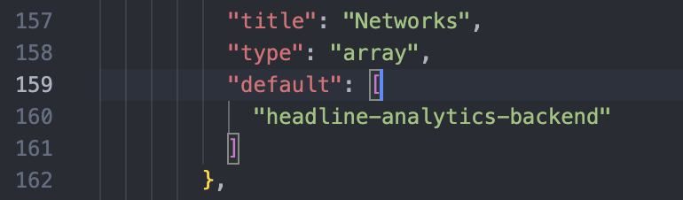

# Prefect

Prefect is a Python package (more lightweight than its competitors like Dagster or Airflow) designed for orchestrating and scheduling workflows.

They have written some very insightful and easy-to-read documentation which can be consumed [here](https://docs.prefect.io/v3/get-started/index). But, in what follows, I will try to cover how Prefect has been used on this project to automate the data pipeline we have built.

## Entrypoints

Prefect has been used to automate the following pipelines (or, 'flows' as it is known in the Prefect universe),

* `_pipeline_deploy.py`: the ELT pipeline which takes data from the New York Times Archive Search response, ingests and transforms that data inside our local Postgres data warehouse
* `_logit_deploy.py`: the logistic growth model which operates on a given subset of the data stored in the data warehouse (over a certain time horizon) to fit and store the growth coefficients associated with each topic

Each of these scripts creates and stores a Docker image (which you can optionally push to Docker Hub too) which will be 'administered' everytime the deployment is triggered. It can be triggered via a CRON schedule or at will by manual means.

To setup Prefect on your local machine, follow the 'setup' steps listed in `README.md`. Some nuances are expounded upon below.

## `DOCKER_HOST`

For reasons I couldn't quite surmise until I troubleshooted endlessly and looked around online, when running this system on MacOS you appear to be required to specify the `DOCKER_HOST` socket in order for Prefect to initiate a worker process that relies on Docker.

If you type `docker context ls` into your terminal you will see something like the following (on MacOS),

```
NAME              DESCRIPTION                               DOCKER ENDPOINT                                ERROR
default           Current DOCKER_HOST based configuration   unix:///var/run/docker.sock                    
desktop-linux *   Docker Desktop                            unix:///Users/Johnny/.docker/run/docker.sock 
```

You essentially need to `export` the second of these commands prior to running anything docker related - you can assign this to your deployments (and this is done by default in `_pipeline_deploy.py` for instance).

## Networks

When you create a 'work pool' via Prefect (i.e. an abstraction that is used by Prefect to manage 'workers' or processes on your machine), it will not be associated with any networks when a worker starts a Docker container from that pool.

This is a problem if you are hosting your database locally inside a container because Docker compose, by default, segregates containers from the local network infrastructure.

To avoid this, we can supplement the work pool with a `base-job-template.json` which you can find in the `config/` directory by default.

If you scroll down to the 'Networks' property you will find an entry listed as follows,



This corresponds to the network listed inside the `docker-compose.yaml` file. 

By adding this entry we can ensure that the worker process in Prefect can communicate with our Postgres container as expected.


